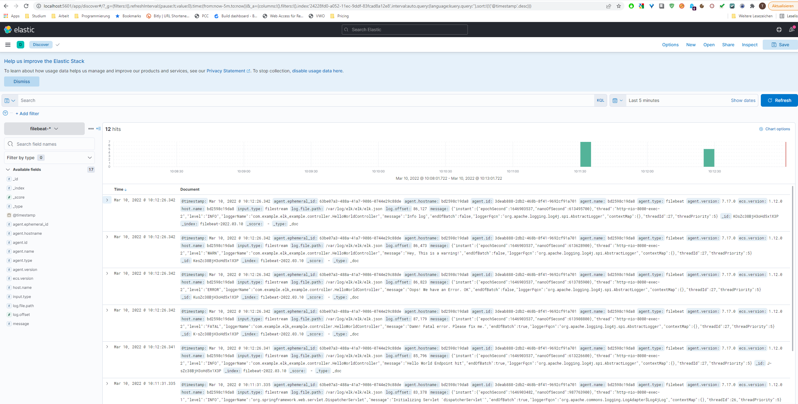

# ELK Log4J Logger

BuildStatus: 

## Description
- Logging Java-SpringBoot-Application with log4j 
- Configuration over external log4j2.xml in src/resources
- Log JSON to filesystem mounted as Volume in Docker-Compose
- Read logs with filebeat from mounted Volume
- Push logs to started elasticsearch 
- Visualize the logfiles with kibana

## Requirements
- Docker
- Docker Compose

## Docker Image
A prebuild image is located at:
```docker pull vvthromildner/java-elk-logger:latest```


## Using
1. Run ```docker-compose up -d```. This will build the example-application and start filebeat, elasticsearch.
2. Call ```http://localhost:8080/helloWorld``` Endpoint to generate log entries.
3. Call ```http://localhost:5601``` with your browser.
4. Add index "filebeat-*" in Kibana.
5. Visualize LogFiles in Kibana.

## Kibana
http://localhost:5601/app/discover#/?_g=(filters:!(),refreshInterval:(pause:!t,value:0),time:(from:now-5m,to:now))&_a=(columns:!(),filters:!(),index:'92825bc0-a04f-11ec-98f8-ab7971fbdb04',interval:auto,query:(language:kuery,query:%22INFO%22),sort:!(!('@timestamp',desc)))


